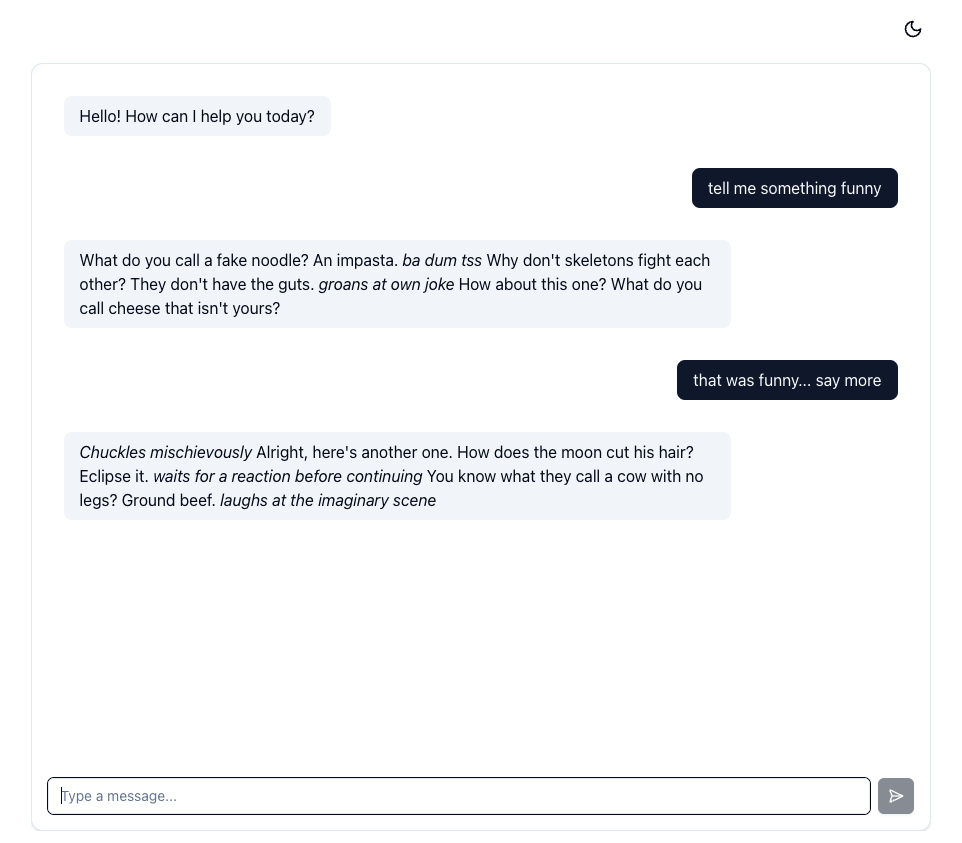

# Chat App

This is a basic chat app. More info here soon! Go [here](https://chai-chat-demo.foobar.dev/) to see the demo.




## Setup

### Backend

See [server/README.md](server/README.md) for more info.


### Frontend

1. Navigate to client directory

```bash
cd client
```

2. Install dependencies

```bash
npm install
```

3. Run locally

```bash
npm run dev
```
